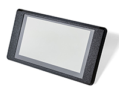
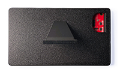
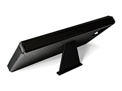

# crowpanel-5.0-esp32-lvgl-micropython

MicroPython + LVGL starter project for the **Elecrow CrowPanel 5.0" ESP32-S3 HMI** (800×480, capacitive touch) with a ready-to-use **quick launcher**, SquareLine export guidance, and **terminal-only** workflows for flashing and file transfer.

> **What you get**
>
> * A minimal, robust **launcher script** to bring up LVGL and load your SquareLine UI.
> * Step-by-step **terminal commands** for flashing MicroPython and copying files (macOS/Linux).
> * A clear **SquareLine → MicroPython** export path (no Arduino/C required).
> * Troubleshooting tips that match common CrowPanel quirks.

---

## Contents

- [Requirements](#requirements)
- [Firmware (not included)](#firmware-not-included)
- [Flash the device (terminal only)](#flash-the-device-terminal-only)
- [🖐️ Quick “Hello World” Demo](#quick-hello-world-demo)
- [🧱 SquareLine → MicroPython Export](#squareline--micropython-export)
- [Run your UI](#run-your-ui)
- [Connecting to the REPL](#connecting-to-the-repl)
- [Troubleshooting](#troubleshooting)
- [🧰 Enclosure (3D Printable)](#enclosure-3d-printable)
- [Legal & licensing](#legal--licensing)
- [Links](#links)


---

## Requirements

* **Computer:** macOS or Linux (not tested on Windows, but should work once you adjust serial port names).
* **Python tooling:**

  ```bash
  python3 -m pip install --upgrade esptool mpremote
  ```
* **USB-C cable** to the CrowPanel 5.0" ESP32-S3.

---

## Firmware (not included)

This repo **does not** redistribute vendor firmware or drivers.
Download the official **MicroPython firmware for CrowPanel 5.0"** from Elecrow’s wiki/tutorial and resources:

* Elecrow: **ESP32 HMI 5.0" MicroPython tutorial** (contains the `firmware-5.0-A.bin` download instructions). ([Elecrow][1])
* The firmware can be found at step 6 of the "Upload firmware" instructions, which links to the following: [firmware-5.0-A.bin](https://www.elecrow.com/download/product/CrowPanel/ESP32-HMI/5.0-DIS07050H/MicroPython/firmware.zip)
* Once downloaded, extract the `.bin` file from the Zip.

> You must download the firmware yourself from Elecrow’s official page(s). This repo only references it.

---

## Flash the device (terminal only)

Start by putting the board in **bootloader (download) mode**: Hold down the **BOOT** button. While holding, tap and release the **RESET** button, then release **BOOT**. 

> Note: In this mode, the device's own screen will be blank.

Find your serial device (example on macOS):

```bash
ls /dev/tty.usb*
# e.g. /dev/tty.usbserial-110
```

Erase and flash (replace the port and path to your downloaded `.bin`):

```bash
# erase
esptool.py --chip esp32s3 --port /dev/tty.usbserial-110 erase_flash

# write firmware
esptool.py --chip esp32s3 --port /dev/tty.usbserial-110 --baud 460800 \
  write_flash -z 0x0 /path/to/firmware-5.0-A.bin
```

After “Hash of data verified”, press **RESET**.

---

## 🖐️ Quick “Hello World” Demo

Before building your own UI in SquareLine, start with the included **Hello World** demo to confirm your setup.

### Step 1 - Copy the demo files to your device

Make sure your CrowPanel is connected via USB, then run:

```bash
# Copy the demo files provided in this repo
mpremote connect /dev/tty.usbserial-110 fs cp ui.py :
mpremote connect /dev/tty.usbserial-110 fs cp ui_images.py :
mpremote connect /dev/tty.usbserial-110 fs cp quick_launcher.py :
```

You can verify the files were transferred:

```bash
mpremote connect /dev/tty.usbserial-110 fs ls
```


### Step 2 - Run the launcher

Run the included launcher to start the demo UI:

```bash
mpremote connect /dev/tty.usbserial-110 run quick_launcher.py
```

If everything is working correctly, you’ll see:

* A **“Press Me!”** button on screen.
* Touch input responds — pressing the button triggers a simple LVGL action and allows our button to say Hello to the World.


### Once the Hello World screen works, you know:

* Your **firmware and LVGL** are configured correctly.
* The **display and touch** drivers are responding.
* File transfers via `mpremote` are working.

You’re now ready to move on to [SquareLine → MicroPython export](#squareline--micropython-export).

---

## 🧱 SquareLine → MicroPython Export

If you’re new to SquareLine Studio, it’s easy to think of it as an IDE that compiles or runs code directly on your device; **it’s not**. SquareLine is a **visual UI designer** that helps you build interfaces for LVGL (the graphics library running on your CrowPanel).
It doesn’t flash or execute code. Instead, it **generates LVGL source files**; and it’s up to you (and this repo’s launcher) to copy those `.py` files to your device and run them under MicroPython.


### Step 1 - Install the CrowPanel board platform

SquareLine uses *Open Board Platforms (OBP)* to define hardware configurations — things like LVGL version, screen resolution, and colour depth.
This repository includes a **ready-made OBP** for the **CrowPanel 5.0" ESP32-S3**, fully compatible with your MicroPython firmware (LVGL 8.3.7).

To install it:

1. Locate your SquareLine user boards folder:

   | OS                | Path                                |
   | ----------------- | ----------------------------------- |
   | **macOS / Linux** | `~/SquareLine/boards/`              |
   | **Windows**       | `C:\Users\<you>\SquareLine\boards\` |

2. Copy the provided `/boards/crowpanel_5_micropython` folder from this repository into that location.

   Example:

   ```
   ~/SquareLine/boards/crowpanel_5_micropython/v1_0_0/
   ```

    > You can also place this in a Elecrow subfolder, so that:
    >   ```
    >   ~/SquareLine/boards/Elecrow/crowpanel_5_micropython/v1_0_0/
    >   ```

3. Restart SquareLine Studio.

You’ll now see a new entry under **Create → Desktop → CrowPanel 5.0" ESP32-S3 (MicroPython)**.

This ensures your project automatically uses:

* LVGL 8.3.7
* 800×480 resolution
* 16-bit colour
* MicroPython export format


### Step 2 - Design your UI

Use SquareLine’s drag-and-drop editor to build your layout (buttons, labels, sliders, etc.).
You can preview within SquareLine, but remember: this preview is running **on your computer**, not your CrowPanel.


### Step 3 - Export your UI to MicroPython

When your design is ready, go to:

```
File → Export UI Files
```

SquareLine will generate:

```
ui.py
ui_images.py
```

By convention, this project expects you to export into an `export/` folder like this:

```
my-project/
├─ export/
│   ├─ ui.py
│   └─ ui_images.py
└─ quick_launcher.py
```

---

### Step 4 - Copy your exported files to the CrowPanel

Use `mpremote` to move the exported files from your local `export/` folder to the device:

```bash
mpremote connect /dev/tty.usbserial-110 fs cp export/ui.py :
mpremote connect /dev/tty.usbserial-110 fs cp export/ui_images.py :
```

Then copy or run your launcher:

```bash
mpremote connect /dev/tty.usbserial-110 fs cp quick_launcher.py :
mpremote connect /dev/tty.usbserial-110 run quick_launcher.py
```

If the display shows your layout, you’ve successfully exported and deployed a SquareLine UI under MicroPython.


## Run your UI

Run once (without auto-start):

```bash
mpremote connect /dev/tty.usbserial-110 run quick_launcher.py
```

Auto-start on boot (optional):

```bash
mpremote connect /dev/tty.usbserial-110 fs cp quick_launcher.py :main.py
# reset the board
```

---

## Connecting to the REPL

You can open the **MicroPython REPL** (interactive Python prompt) over USB using `screen`.

### On macOS / Linux

#### Step 1 - Find your device’s serial port:

```bash
ls /dev/tty.usb*
# Example output: /dev/tty.usbserial-110
```

#### Step 2 - Connect to the REPL:

```bash
screen /dev/tty.usbserial-110 115200
```

You’ll see a blank screen — press **Enter** once or twice until you get:

```
>>>
```

That’s the MicroPython prompt. You can now type commands directly on the device.


### Common shortcuts

| Key combo                  | Action                                                          |
| -------------------------- | --------------------------------------------------------------- |
| `Ctrl+C`                   | Stop a running script (use this to break a loop or boot script) |
| `Ctrl+D`                   | Soft reboot (restart MicroPython without power-cycling)         |
| `Ctrl+A` then `Ctrl+\`     | Exit `screen`                                                   |
| `Ctrl+A` then `K` then `y` | Alternative way to quit `screen`                                |


## Troubleshooting

**Stuck in a boot loop?**
Connect to the **serial REPL** and press **Ctrl+C** rapidly to break in, then:
```python
import os
os.remove("main.py")
```

**White screen after launching**

* Most common cause: display registered twice. Ensure the launcher **only** registers a display when `lv.disp_get_default()` returns `None`.

**`AttributeError: 'NoneType' object has no attribute 'set_theme'` when importing `ui`**

* Importing `ui.py` before a default display exists. Make sure the launcher creates/obtains a display **before** `import ui`.

**Button clicks do nothing**

* Touch input not registered. Your firmware’s `tft_config` may not expose `touch_read`. You can register a GT911 reader in the launcher or add a proper driver separately. (GT911 is common for CrowPanel.)

**Exported C files instead of Python**

* Switch **Project Settings → Language = MicroPython** in SquareLine, then **Export** again. ([Forum - SquareLine Studio][3])

**Where is the firmware download?**

* Elecrow’s official **5.0" MicroPython tutorial** page links the `firmware-5.0-A.bin`. Download it there and flash via `esptool.py`. ([Elecrow][1])

---

## 🧰 Enclosure (3D Printable)

[](enclosure/enclosure-front-full.jpeg) [](enclosure/enclosure-back-full.jpeg) [](enclosure/enclosure-stand-full.jpeg)

A 3D-printable enclosure for the **CrowPanel 5.0" ESP32-S3** is included in this repository. It provides a clean desktop setup with easy physical access to the device’s key functions.

**File:** `crowpanel-5.0-custom-enclosure.3mf`
**Folder:** `/hardware/`
**Printer:** Bambu Lab A1 (sliced version provided)

**Recommended print settings:**

* 0.4 mm nozzle
* PLA filament
* 0.2 mm layer height
* 20 % Gyroid infill
* **No supports required**

**Features:**

* Rear cutouts for **BOOT** and **RESET** buttons (easily accessible without removing the device).
* Side opening for a **USB-C cable**, allowing connection or power while enclosed.
* Integrated **stand** that slots into the back and positions the display at a comfortable **45° viewing angle**. (For increased stability, glue the stand into its slot.)
* Simple snap-in top allows closing the enclosure without permanently locking the device in place.

> The model should also print well on most FDM printers using similar settings. Adjust flow and first-layer parameters as needed for your printer and filament.

---

## Legal & licensing

* **No firmware or vendor driver redistribution.**
  This project **references** third-party files (e.g., Elecrow’s `firmware-5.0-A.bin`, `tft_config.py`, `gt911.py`) but does **not** include or host them. Download them from official sources.
* **Trademarks & ownership:** Elecrow, LVGL, and SquareLine are trademarks of their respective owners.

---

## Links

- **Elecrow:** [ESP32 HMI 5.0" MicroPython Tutorial][1]
- **SquareLine Docs:** [Overview (C++ & MicroPython export)][2]
- **SquareLine Forum:** [How do I export a project to Python?][3]

---

[1]: https://www.elecrow.com/wiki/5.0-inch_ESP32_Display_MicroPython_Tutorial.html
[2]: https://docs.squareline.io/docs/introduction/overview/
[3]: https://forum.squareline.io/t/how-do-i-export-a-project-to-python/1365
